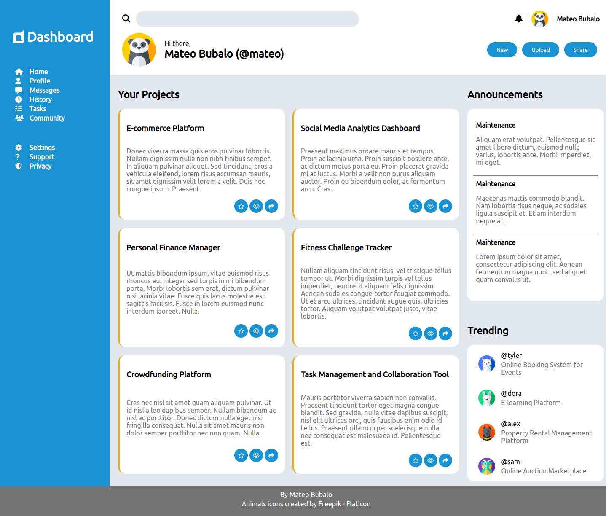
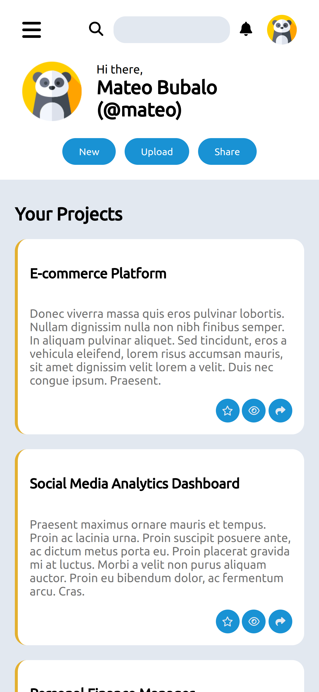

# Admin Dashboard

Admin Dashboard is a project built as a part of the Full Stack JavaScript course on The Odin Project. The project was built to demonstrate CSS Grid knowledge that has been taught so far in this course.

## [Live Demo](https://mateoo04.github.io/admin-dashboard/)

{: style="width:450px; height: auto;"}

## Resources used
- [Font Awesome](https://fontawesome.com/) (Logo and button icons)
- [Flaticon](https://www.flaticon.com/free-icons/) (Animal icons for user profile pics)
- [Google Fonts](https://fonts.google.com/) (Fonts used)

## Technologies used
* HTML
* CSS (Grid + Flexbox)